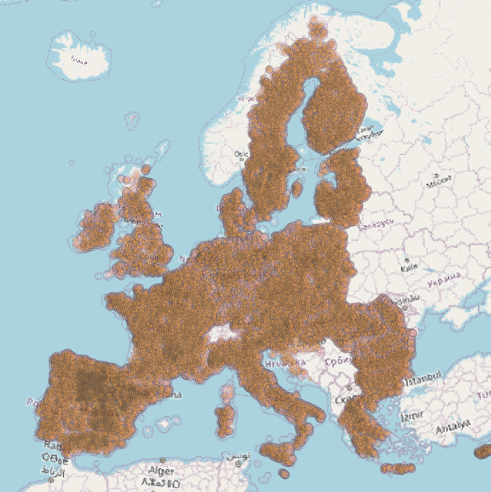
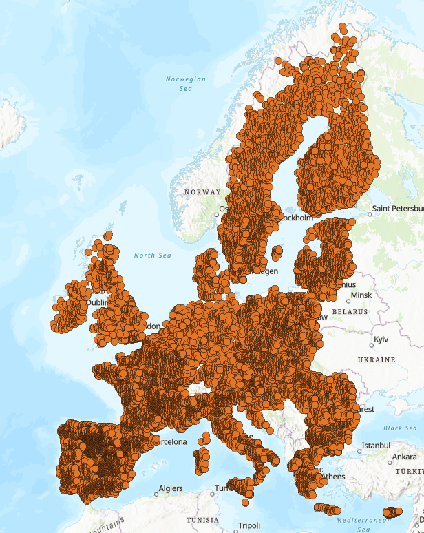
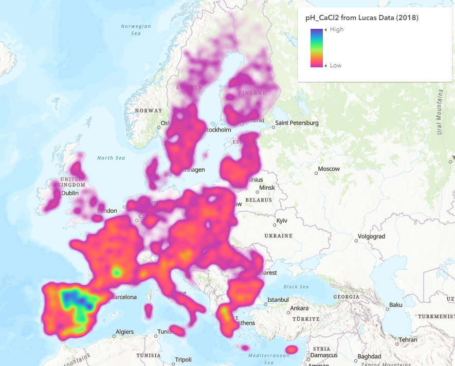

# AI for LifeSciences Hackathon 2023
[Notion Site](https://wax-butterfly-46f.notion.site/AI4LS-1-Info-for-Participants-b8dd7d8e2c9e4d94a111086043d1bc9d)
## November 15 - December 20

### Datasets
The land usage data for years 2009, 2015 and 2018 is available in this repository.
The microbiome sequence data is available for a short while [here](https://vaquitatechnologies-my.sharepoint.com/:f:/g/personal/vijayasekhar_gullapalli_vaqtech_com/Ep0R0pypvWlOn1HB9-NDXY0BagmWwyPKlZrB2dQ-Efv_5w?e=o9O3Jw). The total size of microbiome sequence data is around 75 GB.

Here is the overlay of land usage data.

### Tools & Applications
#### GIS (Geographical Information Systems)
[QGIS](https://qgis.org/en/site/) is a free open source geographical information system. Using this we can visualize the ESRI data in LUCAS datasets. Documentation [link](https://docs.qgis.org/3.4/en/docs/index.html)

[ARCGIS Maps SDK for .NET](https://developers.arcgis.com/net/) could be useful, if WPF or Blazor applicaitons are built, for visualization needs.

#### Data Analysis & User Interfaces
For python 3 notebooks, a single virtual environment is used and analysis spread across multiple notebooks. Using Jupyter extension in VSCode.

(.NET 8.0)[https://dotnet.microsoft.com/en-us/download/dotnet/8.0] used for data cleanup, api integrations and some application development. Requires installation of SDK for development. 

Vanilla JavaScript, is used for user interface, since some of the renderers for ArcGis are not well documented for .net WPF applications. Some screenshots for the initial javascript application

